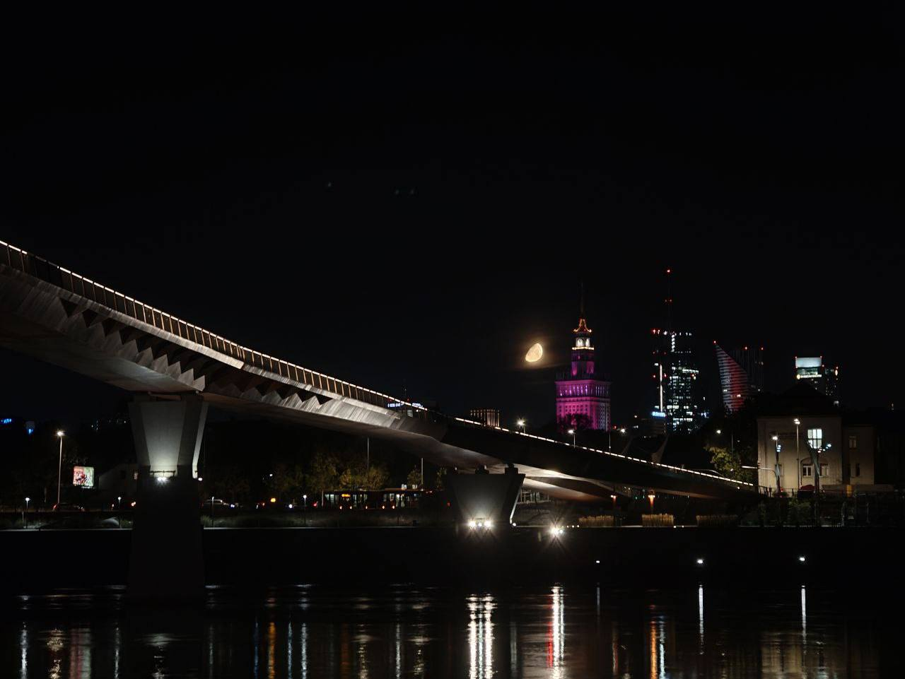

Years of fighting, it finally stopped.

My heartbeat slowed, my mind grew quiet. No more fighting, no struggle, no pain – I sat by the Vistula, looking at the sky, still and scattered with stars.

In a moment, I saw the world through a child’s eyes – full of love, full of peace.

Then came the pines. The vast, lonely forest.
It’s scary sometimes – it scares a child’s heart.

And it makes me miss peace.
You were that peace –
the first of its kind.

I've got wounds on the right hand, but now I have on the left, one from your cigarette.

You never loved me – it doesn’t matter anymore.
You will always remain, to me, my lovely girl.
As you made me feel love deeply again.

